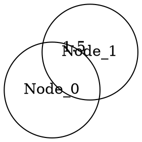

# グラフデータ形式ガイド

グラフを表現・保存するための主要なファイル形式を包括的に解説します。

## 目次
- [標準的なグラフ形式](#標準的なグラフ形式)
- [テキストベース形式](#テキストベース形式)
- [バイナリ形式](#バイナリ形式)
- [Web/GIS向け形式](#webgis向け形式)
- [プログラミング言語特化形式](#プログラミング言語特化形式)
- [形式比較表](#形式比較表)
- [SWAGGERでの使用](#swaggerでの使用)

---

## 標準的なグラフ形式

### 1. GML (Graph Modeling Language) ⭐

**現在SWAGGERで使用中**

```gml
graph [
  directed 0
  node [
    id 0
    label "Node_0"
    value 42
  ]
  edge [
    source 0
    target 1
    weight 1.5
  ]
]
```

**特徴:**
- ✅ 人間が読みやすいテキスト形式
- ✅ 階層構造で属性を表現
- ✅ 多くのツール（Gephi、yEd）が対応
- ✅ カスタム属性を追加可能

**用途:**
- グラフ可視化
- グラフ分析
- データ交換

**NetworkXでの読み書き:**
```python
import networkx as nx

# 読み込み
graph = nx.read_gml('graph.gml')

# 保存
nx.write_gml(graph, 'graph.gml')
```

---

### 2. GraphML

XMLベースの標準的なグラフ形式。

```xml
<?xml version="1.0" encoding="UTF-8"?>
<graphml xmlns="http://graphml.graphdrawing.org/xmlns">
  <key id="d0" for="node" attr.name="label" attr.type="string"/>
  <key id="d1" for="edge" attr.name="weight" attr.type="double"/>
  <graph id="G" edgedefault="undirected">
    <node id="n0">
      <data key="d0">Node_0</data>
    </node>
    <node id="n1">
      <data key="d0">Node_1</data>
    </node>
    <edge id="e0" source="n0" target="n1">
      <data key="d1">1.5</data>
    </edge>
  </graph>
</graphml>
```

**特徴:**
- ✅ XML標準に準拠
- ✅ スキーマ定義可能
- ✅ 型情報を含む
- ✅ 厳密な構造検証
- ❌ ファイルサイズが大きい

**用途:**
- 学術研究
- データ交換（厳密な型が必要）
- XMLツールとの統合

**NetworkXでの使用:**
```python
import networkx as nx

# 読み込み
graph = nx.read_graphml('graph.graphml')

# 保存
nx.write_graphml(graph, 'graph.graphml')
```

**SWAGGERグラフをGraphMLに変換:**
```python
import networkx as nx

# GMLを読み込み
graph = nx.read_gml('output/graph.gml')

# GraphMLで保存
nx.write_graphml(graph, 'output/graph.graphml')
```

---

### 3. DOT (Graphviz)

Graphviz用の標準形式。



**特徴:**
- ✅ シンプルで読みやすい
- ✅ レイアウト指定可能
- ✅ 可視化に特化
- ✅ コマンドラインから画像生成可能

**用途:**
- グラフ可視化
- ドキュメント生成
- フローチャート

**画像生成:**
```bash
# PNG生成
dot -Tpng graph.dot -o graph.png

# SVG生成
dot -Tsvg graph.dot -o graph.svg

# PDF生成
dot -Tpdf graph.dot -o graph.pdf
```

**NetworkXでの使用:**
```python
import networkx as nx
from networkx.drawing.nx_pydot import write_dot

graph = nx.read_gml('output/graph.gml')
write_dot(graph, 'graph.dot')
```

---

### 4. GEXF (Graph Exchange XML Format)

Gephiの標準形式。動的グラフにも対応。

```xml
<?xml version="1.0" encoding="UTF-8"?>
<gexf xmlns="http://www.gexf.net/1.2draft" version="1.2">
  <graph mode="static" defaultedgetype="undirected">
    <nodes>
      <node id="0" label="Node_0">
        <attvalues>
          <attvalue for="0" value="42"/>
        </attvalues>
      </node>
    </nodes>
    <edges>
      <edge id="0" source="0" target="1" weight="1.5"/>
    </edges>
  </graph>
</gexf>
```

**特徴:**
- ✅ 時系列データ対応
- ✅ ノード・エッジの属性豊富
- ✅ Gephiでの最適なサポート
- ✅ 可視化プロパティ保存可能

**用途:**
- ソーシャルネットワーク分析
- 動的ネットワーク分析
- Gephiでの高度な可視化

**NetworkXでの使用:**
```python
import networkx as nx

graph = nx.read_gml('output/graph.gml')
nx.write_gexf(graph, 'output/graph.gexf')
```

---

## テキストベース形式

### 5. Edge List

最もシンプルな形式。

```
# source target weight
0 1 1.5
1 2 2.0
2 3 1.2
```

**特徴:**
- ✅ 極めてシンプル
- ✅ ファイルサイズ最小
- ✅ 高速読み込み
- ❌ ノード属性なし
- ❌ メタデータなし

**用途:**
- 大規模グラフの保存
- 簡易的なデータ交換
- 実験・プロトタイプ

**NetworkXでの使用:**
```python
import networkx as nx

# 読み込み（重み付き）
graph = nx.read_edgelist('edges.txt', data=(('weight', float),))

# 保存
nx.write_edgelist(graph, 'edges.txt', data=['weight'])
```

**SWAGGERグラフからEdge Listを生成:**
```python
import networkx as nx

graph = nx.read_gml('output/graph.gml')

# エッジリスト保存
with open('output/edges.txt', 'w') as f:
    for u, v, data in graph.edges(data=True):
        weight = data.get('weight', 1.0)
        f.write(f"{u} {v} {weight}\n")
```

---

### 6. Adjacency List

隣接リスト形式。

```
# Node: Neighbors
0: 1 2 3
1: 0 4
2: 0 5
3: 0
4: 1
5: 2
```

**特徴:**
- ✅ 疎グラフに効率的
- ✅ 読みやすい
- ❌ エッジ属性に制限

**用途:**
- アルゴリズムの入力
- グラフ構造の簡易表現

**NetworkXでの使用:**
```python
import networkx as nx

# 読み込み
graph = nx.read_adjlist('adjlist.txt')

# 保存
nx.write_adjlist(graph, 'adjlist.txt')
```

---

### 7. Matrix Market Format (.mtx)

疎行列形式。数値計算向け。

```
%%MatrixMarket matrix coordinate real general
3 3 4
1 2 1.5
2 3 2.0
3 1 1.2
```

**特徴:**
- ✅ 疎行列の標準形式
- ✅ 数値計算ライブラリと互換
- ✅ 大規模行列に効率的

**用途:**
- 科学計算
- 機械学習
- グラフ理論の数値計算

**SciPyでの使用:**
```python
import networkx as nx
from scipy.io import mmwrite, mmread
from scipy.sparse import csr_matrix

graph = nx.read_gml('output/graph.gml')

# 隣接行列を取得
adj_matrix = nx.adjacency_matrix(graph)

# Matrix Market形式で保存
mmwrite('graph.mtx', adj_matrix)

# 読み込み
adj_matrix_loaded = mmread('graph.mtx')
```

---

## バイナリ形式

### 8. Pickle (Python)

Pythonオブジェクトのシリアライゼーション。

**特徴:**
- ✅ Python標準ライブラリ
- ✅ 高速な読み書き
- ✅ 完全なオブジェクト保存
- ❌ Python専用
- ❌ バージョン依存性

**用途:**
- Python内部でのキャッシュ
- 一時保存
- プロトタイピング

**使用例:**
```python
import networkx as nx
import pickle

graph = nx.read_gml('output/graph.gml')

# 保存
with open('graph.pkl', 'wb') as f:
    pickle.dump(graph, f)

# 読み込み
with open('graph.pkl', 'rb') as f:
    graph = pickle.load(f)
```

**SWAGGERの現在の使用:**
モジュラースクリプトの中間データ保存に使用中：
- `step1_data.pkl`
- `step2_data.pkl`
- ...
- `final_graph.pkl`

---

### 9. HDF5

階層的データ形式。大規模データ向け。

**特徴:**
- ✅ 大規模データに最適
- ✅ 部分読み込み可能
- ✅ 圧縮対応
- ✅ 多言語対応

**用途:**
- 大規模グラフ（100万ノード以上）
- 科学データ
- 機械学習データセット

**使用例:**
```python
import networkx as nx
import h5py
import numpy as np

graph = nx.read_gml('output/graph.gml')

# HDF5で保存
with h5py.File('graph.h5', 'w') as f:
    # ノード情報
    node_ids = list(graph.nodes())
    f.create_dataset('nodes', data=node_ids)

    # エッジ情報
    edges = np.array(list(graph.edges()))
    f.create_dataset('edges', data=edges)

    # エッジの重み
    weights = [graph[u][v].get('weight', 1.0) for u, v in graph.edges()]
    f.create_dataset('weights', data=weights)
```

---

### 10. Protocol Buffers (Protobuf)

Googleのシリアライゼーション形式。

**特徴:**
- ✅ 高速
- ✅ コンパクト
- ✅ 多言語対応
- ✅ スキーマ定義

**用途:**
- マイクロサービス間通信
- RPC
- 高性能アプリケーション

---

## Web/GIS向け形式

### 11. GeoJSON ⭐

**Nav2統合で使用中**

```json
{
  "type": "FeatureCollection",
  "features": [
    {
      "type": "Feature",
      "geometry": {
        "type": "Point",
        "coordinates": [12.34, 56.78]
      },
      "properties": {
        "id": 0,
        "label": "Node_0"
      }
    }
  ]
}
```

**詳細は [GML_AND_NAV2_INTEGRATION_ja.md](GML_AND_NAV2_INTEGRATION_ja.md) を参照**

---

### 12. TopoJSON

GeoJSONの圧縮版。

**特徴:**
- ✅ GeoJSONより小さい（最大80%削減）
- ✅ トポロジー保存
- ✅ Web地図に最適

**用途:**
- Web地図の高速化
- モバイルアプリ

---

### 13. KML (Keyhole Markup Language)

Google Earth用の形式。

```xml
<?xml version="1.0" encoding="UTF-8"?>
<kml xmlns="http://www.opengis.net/kml/2.2">
  <Document>
    <Placemark>
      <name>Node 0</name>
      <Point>
        <coordinates>-122.0856545755255,37.42243077405461,0</coordinates>
      </Point>
    </Placemark>
  </Document>
</kml>
```

**特徴:**
- ✅ Google Earth/Maps対応
- ✅ 3D表示可能
- ✅ スタイル定義

**用途:**
- Google Earthでの可視化
- 地理データ共有

---

### 14. Shapefile

GISの標準形式。

**特徴:**
- ✅ GISで広く使用
- ✅ 地理座標対応
- ❌ 複数ファイル必要（.shp, .shx, .dbf）

**用途:**
- GIS分析
- 地図作成

---

## プログラミング言語特化形式

### 15. JSON Graph Format

```json
{
  "graph": {
    "directed": false,
    "nodes": [
      {"id": "0", "label": "Node_0", "metadata": {"value": 42}}
    ],
    "edges": [
      {"source": "0", "target": "1", "metadata": {"weight": 1.5}}
    ]
  }
}
```

**特徴:**
- ✅ JavaScript/Web標準
- ✅ 人間が読みやすい
- ✅ パース容易

**NetworkXでの使用:**
```python
import networkx as nx
from networkx.readwrite import json_graph
import json

graph = nx.read_gml('output/graph.gml')

# JSON形式で保存
data = json_graph.node_link_data(graph)
with open('graph.json', 'w') as f:
    json.dump(data, f, indent=2)

# 読み込み
with open('graph.json', 'r') as f:
    data = json.load(f)
graph = json_graph.node_link_graph(data)
```

---

### 16. YAML Graph Format

```yaml
graph:
  directed: false
  nodes:
    - id: 0
      label: Node_0
      value: 42
  edges:
    - source: 0
      target: 1
      weight: 1.5
```

**特徴:**
- ✅ 人間が最も読みやすい
- ✅ コメント可能
- ✅ 設定ファイルと統合可能

**使用例:**
```python
import networkx as nx
import yaml

graph = nx.read_gml('output/graph.gml')

# YAML形式で保存
data = {
    'directed': graph.is_directed(),
    'nodes': [
        {'id': node, **data}
        for node, data in graph.nodes(data=True)
    ],
    'edges': [
        {'source': u, 'target': v, **data}
        for u, v, data in graph.edges(data=True)
    ]
}

with open('graph.yaml', 'w') as f:
    yaml.dump(data, f, default_flow_style=False)
```

---

### 17. CSV (複数ファイル)

**nodes.csv:**
```csv
id,label,world_x,world_y,pixel_row,pixel_col
0,Node_0,12.34,56.78,247,1135
1,Node_1,12.45,56.89,249,1137
```

**edges.csv:**
```csv
source,target,weight,edge_type
0,1,1.52,skeleton
1,2,2.34,boundary
```

**特徴:**
- ✅ Excelで編集可能
- ✅ データベースとの互換性
- ✅ 表形式データ分析に最適
- ❌ 2つのファイルが必要

**使用例:**
```python
import networkx as nx
import pandas as pd

graph = nx.read_gml('output/graph.gml')

# ノードをCSVに保存
nodes_data = []
for node, data in graph.nodes(data=True):
    node_dict = {'id': node}
    node_dict.update(data)
    nodes_data.append(node_dict)

pd.DataFrame(nodes_data).to_csv('nodes.csv', index=False)

# エッジをCSVに保存
edges_data = []
for u, v, data in graph.edges(data=True):
    edge_dict = {'source': u, 'target': v}
    edge_dict.update(data)
    edges_data.append(edge_dict)

pd.DataFrame(edges_data).to_csv('edges.csv', index=False)
```

---

## 形式比較表

### 総合比較

| 形式 | 可読性 | ファイルサイズ | 速度 | ツール対応 | 用途 |
|------|--------|--------------|------|-----------|------|
| **GML** | ⭐⭐⭐⭐ | 中 | 中 | ⭐⭐⭐⭐⭐ | 汎用 |
| **GraphML** | ⭐⭐⭐ | 大 | 遅 | ⭐⭐⭐⭐ | 厳密なデータ交換 |
| **DOT** | ⭐⭐⭐⭐ | 小 | 高速 | ⭐⭐⭐⭐ | 可視化 |
| **GEXF** | ⭐⭐⭐ | 大 | 中 | ⭐⭐⭐ | Gephi |
| **Edge List** | ⭐⭐⭐⭐⭐ | 最小 | 最速 | ⭐⭐⭐ | 大規模グラフ |
| **GeoJSON** | ⭐⭐⭐⭐ | 中 | 中 | ⭐⭐⭐⭐ | Web地図、Nav2 |
| **Pickle** | ⭐ | 小 | 最速 | ⭐⭐ | Python内部 |
| **HDF5** | ⭐ | 最小 | 高速 | ⭐⭐⭐ | 大規模データ |
| **JSON** | ⭐⭐⭐⭐⭐ | 中 | 中 | ⭐⭐⭐⭐⭐ | Web開発 |
| **CSV** | ⭐⭐⭐⭐⭐ | 小 | 高速 | ⭐⭐⭐⭐⭐ | データ分析 |

### 用途別推奨

| 用途 | 推奨形式 | 理由 |
|------|---------|------|
| **論文・発表** | GML, GEXF | Gephi等のツール対応 |
| **Web開発** | GeoJSON, JSON | ブラウザ対応 |
| **GIS** | GeoJSON, Shapefile | 地理データ標準 |
| **データ分析** | CSV, HDF5 | Pandas/表形式 |
| **Python開発** | Pickle, GML | 高速・汎用 |
| **可視化** | DOT, GML | Graphviz, Gephi |
| **ROS2/Nav2** | GeoJSON | Route Server対応 |
| **大規模グラフ** | Edge List, HDF5 | 効率的 |
| **データ交換** | GraphML, GML | 標準的 |
| **機械学習** | HDF5, MTX | NumPy/SciPy対応 |

---

## SWAGGERでの使用

### 現在対応している形式

1. **GML** - メイン出力形式
   ```bash
   python scripts/generate_graph.py --output-dir output/
   # 生成: output/graph.gml
   ```

2. **GeoJSON** - Nav2統合用
   ```bash
   python3 integration/nav2/tools/gml_to_geojson.py \
       output/graph.gml -o output/graph.geojson
   ```

3. **Pickle** - 中間データ保存
   ```bash
   python scripts/run_pipeline.py --output output/
   # 生成: output/step1_data.pkl, step2_data.pkl, ...
   ```

### 追加形式への変換

**GraphMLへ変換:**
```python
import networkx as nx
graph = nx.read_gml('output/graph.gml')
nx.write_graphml(graph, 'output/graph.graphml')
```

**DOTへ変換:**
```python
import networkx as nx
from networkx.drawing.nx_pydot import write_dot

graph = nx.read_gml('output/graph.gml')
write_dot(graph, 'output/graph.dot')
```

**JSONへ変換:**
```python
import networkx as nx
from networkx.readwrite import json_graph
import json

graph = nx.read_gml('output/graph.gml')
data = json_graph.node_link_data(graph)
with open('output/graph.json', 'w') as f:
    json.dump(data, f, indent=2)
```

**CSVへ変換:**
```python
import networkx as nx
import pandas as pd

graph = nx.read_gml('output/graph.gml')

# ノード
nodes = [{'id': n, **d} for n, d in graph.nodes(data=True)]
pd.DataFrame(nodes).to_csv('output/nodes.csv', index=False)

# エッジ
edges = [{'source': u, 'target': v, **d} for u, v, d in graph.edges(data=True)]
pd.DataFrame(edges).to_csv('output/edges.csv', index=False)
```

### 推奨ワークフロー

```bash
# 1. グラフ生成（GML形式）
python scripts/generate_graph.py --map maps/warehouse.png --output-dir output/

# 2. 用途に応じて変換
# Nav2用
python3 integration/nav2/tools/gml_to_geojson.py output/graph.gml -o output/graph.geojson

# 可視化用
python -c "import networkx as nx; from networkx.drawing.nx_pydot import write_dot; write_dot(nx.read_gml('output/graph.gml'), 'output/graph.dot')"
dot -Tpng output/graph.dot -o output/graph.png

# データ分析用
python -c "import networkx as nx; import pandas as pd; g=nx.read_gml('output/graph.gml'); pd.DataFrame([{'source': u, 'target': v, **d} for u,v,d in g.edges(data=True)]).to_csv('output/edges.csv', index=False)"
```

---

## まとめ

### 主要形式の選択基準

**テキストベース:**
- 人間が編集する → **YAML, JSON**
- ツール対応重視 → **GML, GraphML**
- 可視化目的 → **DOT**
- シンプルさ重視 → **Edge List**

**バイナリ:**
- Python専用 → **Pickle**
- 大規模データ → **HDF5**
- 高速通信 → **Protobuf**

**Web/GIS:**
- Web地図 → **GeoJSON**
- ロボティクス → **GeoJSON**
- Google Earth → **KML**

**データ分析:**
- 表形式 → **CSV**
- 科学計算 → **Matrix Market**
- 機械学習 → **HDF5**

### SWAGGERでの推奨

| 用途 | 形式 | コマンド |
|------|------|---------|
| デフォルト | GML | `generate_graph.py` |
| Nav2統合 | GeoJSON | `gml_to_geojson.py` |
| 可視化 | DOT → PNG | `write_dot()` + `dot` |
| 分析 | CSV | pandas変換 |
| キャッシュ | Pickle | 中間データ |

すべての形式は GML をベースに変換できるため、**GML を中心フォーマット**として使用し、必要に応じて他の形式に変換するのが効率的です。
